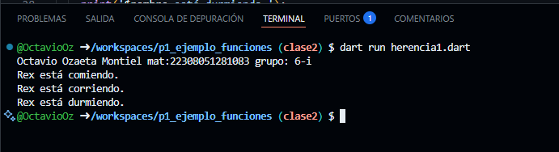

crear una clase animal con los atributos (id_animal, nombre y raza) y una funcion comer(). crear otra clase perro con herencia animal con la funciones correr() y otra dormir(). lenguaje dart

Salida de resultados

