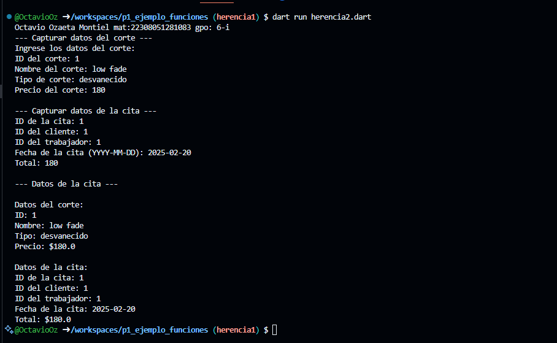

crear la clase Cortes con los atributos (id_corte, nombre_corte, tipo_corte y precio_corte) con una función capturadatos(), con interacción de interfaz de usuario. crear la clase Citas con los atributos (id_cita, id_cliente, id_trabajador, fecha_cita, id_corte y total) con herencia Cortes y una función mostrarDatos(). lenguaje dart

Salida de datos

