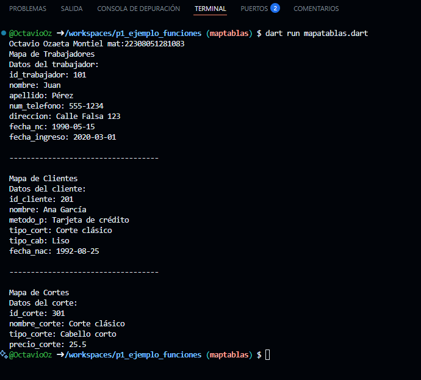

crear map <string dinamic> medicamento con los siguientes Key, id_trabajador, nombre, apellido, num_telefono, direccion, fecha_nc, fecha_ingresoi. y mostrar los datos con un for each, lenguaje dart

crear map <string dinamic> medicamento con los siguientes Key, id_cliente, nombre, metodo_p, tipo_cort, tipo_cab, fecha_nac. y mostrar los datos con un for each, lenguaje dart

crear map <string dinamic> medicamento con los siguientes Key, id_corte, nombre_corte, tipo_corte, precio_corte. y mostrar los datos con un for each, lenguaje dart

